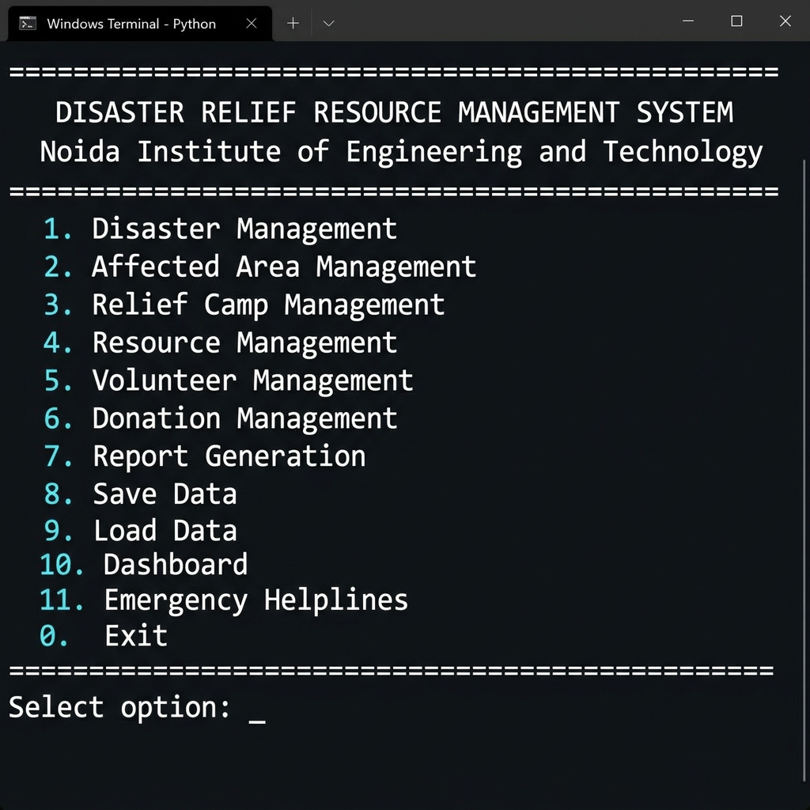
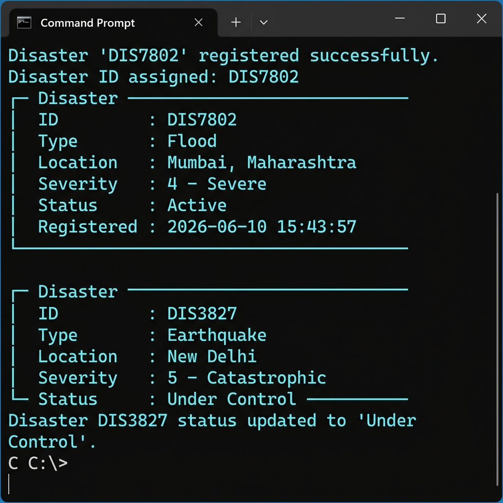
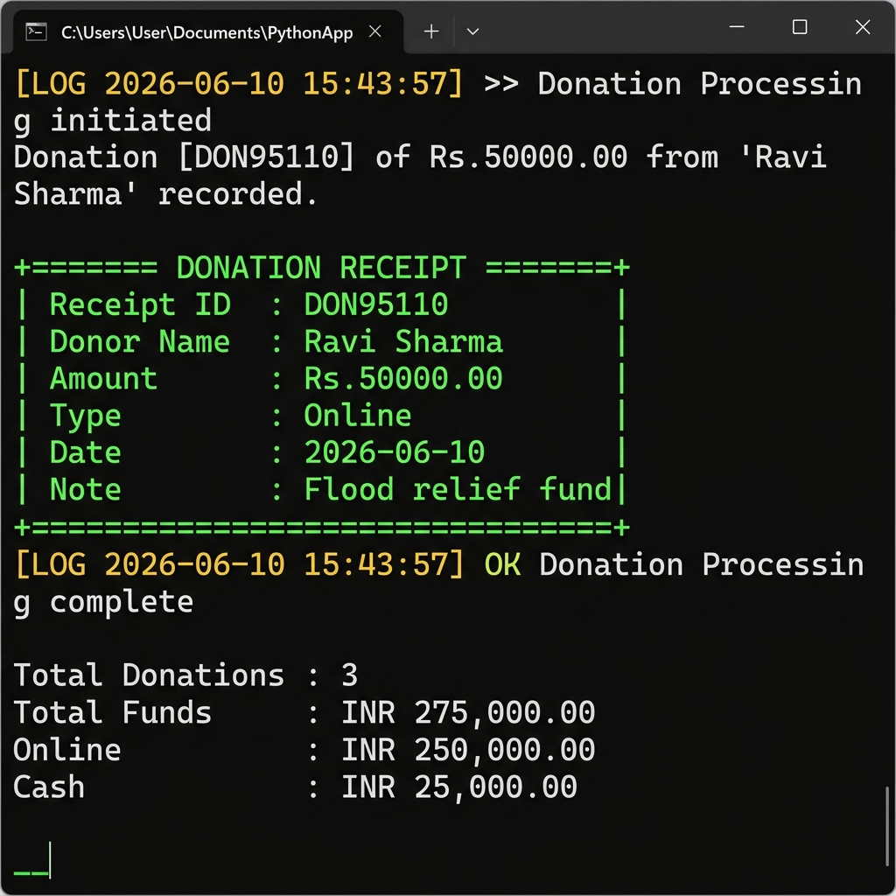

# 🚨 Disaster Relief Resource Management System

> **A comprehensive Python console application for coordinating resources during natural disasters.**  
> Built as a B.Tech CSE Semester Project at Noida Institute of Engineering and Technology.

---

## 📋 Table of Contents

- [Project Overview](#-project-overview)
- [Features](#-features)
- [Screenshots](#-screenshots)
- [Project Structure](#-project-structure)
- [Python Concepts Implemented](#-python-concepts-implemented)
- [OOP Concepts Implemented](#-oop-concepts-implemented)
- [Installation & Running](#-installation--running)
- [How to Use](#-how-to-use)
- [Data Storage](#-data-storage)
- [Learning Outcomes](#-learning-outcomes)

---

## 🌍 Project Overview

The **Disaster Relief Resource Management System** is a Python-based console application that helps authorities manage and coordinate resources during natural disasters such as **floods, earthquakes, cyclones, pandemics**, and other emergencies.

The system enables:
- 📍 Tracking affected areas and populations  
- 🏕️ Managing relief camps and occupancy  
- 📦 Allocating resources (food, water, medicine)  
- 👥 Registering and assigning volunteers  
- 💰 Recording donations and generating receipts  
- 📊 Producing disaster reports and CSV exports  

---

## ✨ Features

| Module | Capabilities |
|---|---|
| **1. Disaster Management** | Register disasters, update status, search recursively, sort by severity |
| **2. Affected Area Management** | Add areas with geo-coordinates, track population, damage reports |
| **3. Relief Camp Management** | Create camps, allocate/release people, enforce capacity limits |
| **4. Resource Management** | Inventory (dict-based), allocate food/water/medicine, restock |
| **5. Volunteer Management** | Register, assign tasks, track availability, skill grouping |
| **6. Donation Management** | Record donations, generate receipts, fund summary, donor history |
| **7. Report Generation** | Generator-based reports, CSV export (3 report types) |
| **Save / Load** | Full JSON persistence with round-trip serialization |
| **Dashboard** | Real-time system-wide statistics panel |
| **Emergency Helplines** | National disaster helpline numbers |

---

## 📸 Screenshots

### Main Menu


---

### Disaster Management — Register & View


---

### Donation Processing — Receipt & Fund Summary


---

### Report Generation — Disaster & Camp Reports


---

### System Dashboard & Data Save


---

## 📁 Project Structure

```
Disaster-Resource-Management-System/
│
├── README.md                            ← You are here
├── .gitignore
├── screenshots/                         ← Application screenshots
│   ├── main_menu.png
│   ├── disaster_management.png
│   ├── donation_receipt.png
│   ├── reports.png
│   └── dashboard.png
│
└── disaster_relief_system/              ← Main project folder
    │
    ├── main.py                          ← Entry point — 11-option menu + DMS root
    │
    ├── models/                          ← All OOP entity classes
    │   ├── person.py                    ← Abstract Base Class (ABC)
    │   ├── volunteer.py                 ← Volunteer(Person) — Inheritance + Polymorphism
    │   ├── donor.py                     ← Donor(Person) — Encapsulation (name mangling)
    │   ├── disaster.py                  ← @staticmethod + @classmethod
    │   ├── affected_area.py             ← location_coords stored as Tuple
    │   ├── relief_camp.py               ← CampCapacityExceeded handling
    │   ├── resource.py                  ← Inventory resource item
    │   ├── donation.py                  ← Receipt generation
    │   └── report.py                    ← CSV export
    │
    ├── modules/                         ← Business logic managers
    │   ├── disaster_manager.py          ← Recursive search, status updates
    │   ├── area_manager.py              ← Area CRUD + resource estimation
    │   ├── camp_manager.py              ← Camp creation + capacity enforcement
    │   ├── resource_manager.py          ← @log_allocation + list comprehensions
    │   ├── volunteer_manager.py         ← Task assignment + availability tracking
    │   ├── donation_manager.py          ← @log_donation + Donor encapsulation
    │   └── report_manager.py            ← Generators (yield) + @log_report + CSV
    │
    ├── utils/                           ← Shared utilities
    │   ├── decorators.py                ← log_action() decorator factory
    │   ├── validators.py                ← 7 custom exceptions + input validators
    │   └── helpers.py                   ← Recursive search, 3 lambda sorts
    │
    └── data/                            ← Auto-created JSON + CSV files
        ├── disasters.json
        ├── camps.json
        ├── volunteers.json
        ├── areas.json
        ├── resources.json
        ├── donations.json
        ├── donors.json
        ├── relief_distribution.csv
        ├── donation_report.csv
        └── camp_occupancy.csv
```

---

## 🐍 Python Concepts Implemented

| Concept | Implementation | File |
|---|---|---|
| Variables & Data Types | Throughout all files | All |
| Conditional Statements | Menu routing, validation | `main.py`, all managers |
| Loops | `while True` menu loop | `main.py` |
| **User-defined Functions** | `allocate_resource()`, `register_disaster()` | `modules/*.py` |
| **Recursive Function** | `search_disaster(records, id, index=0)` | `utils/helpers.py` |
| **Lambda Functions** | 3 sort lambdas (severity, occupancy, amount) | `utils/helpers.py` |
| **List** | `self.disasters`, `self.volunteers`, `self.camps` | `main.py` |
| **Dictionary** | `self.resources = {resource_id: Resource}` | `main.py` |
| **Set** | `self.disaster_categories = set()` | `main.py` |
| **Tuple** | `location_coords = (lat, lng)` — fixed geo-coords | `models/affected_area.py` |
| **List Comprehension** | `[r for r in resources.values() if r.quantity > 0]` | `resource_manager.py` |
| **Decorators** | `@log_action('Resource Allocation')` factory | `utils/decorators.py` |
| **Generators** | `yield` in all report methods | `modules/report_manager.py` |
| JSON File Handling | `save_data()` / `load_data()` | `main.py` |
| CSV File Handling | `export_report()` via `csv.writer` | `report_manager.py` |
| Exception Handling | 7 custom + built-in exceptions | `utils/validators.py` |
| Multiple Modules | `models/`, `modules/`, `utils/` | Project structure |

### Standard Library Modules Used

| Module | Purpose |
|---|---|
| `abc` | Abstract base class support (`Person` class) |
| `datetime` | Timestamps for records and logs |
| `json` | Serialize/deserialize entity records |
| `csv` | Export formatted report files |
| `os` | File path checks, directory creation |
| `random` | Generate unique IDs for all entities |
| `sys` / `io` | UTF-8 console output on Windows |

---

## 🏗️ OOP Concepts Implemented

### Class Hierarchy

```
Person  (Abstract — ABC)
├── Volunteer(Person)     →  Inheritance + Polymorphism
└── Donor(Person)         →  Inheritance + Encapsulation

DisasterManagementSystem  →  Composition Root
├── disasters       : list   (Disaster objects)
├── camps           : list   (ReliefCamp objects)
├── volunteers      : list   (Volunteer objects)
├── areas           : list   (AffectedArea objects)
├── donations       : list   (Donation objects)
├── resources       : dict   ({id: Resource})
└── disaster_categories : set
```

| OOP Concept | Implementation |
|---|---|
| **Abstraction** | `Person` is abstract with `@abstractmethod display_details()` |
| **Inheritance** | `Volunteer(Person)` and `Donor(Person)` inherit from `Person` |
| **Polymorphism** | `display_details()` implemented differently in `Volunteer` vs `Donor` |
| **Encapsulation** | `Donor.__donor_id` and `Donor.__donation_amount` are name-mangled (private) |
| **Composition** | `DisasterManagementSystem` owns all entity lists and manager instances |
| **@staticmethod** | `Disaster.get_emergency_types()`, `ReliefCamp.minimum_camp_size()` |
| **@classmethod** | `Disaster.get_total_count()`, `Disaster.get_active_count()` |
| **Magic Methods** | `__init__`, `__str__`, `__repr__` on all model classes |

### Custom Exception Classes

```python
InvalidDisasterID        # Bad or missing disaster ID
InvalidResourceQuantity  # Zero / negative / excess quantity
CampCapacityExceeded     # Over-capacity allocation attempt
InvalidDonationEntry     # Invalid donation amount
ResourceNotFound         # Resource ID missing from inventory
InvalidAreaID            # Area ID not found
InvalidVolunteerID       # Volunteer ID not found
```

---

## 🚀 Installation & Running

### Requirements
- **Python 3.9+**
- No external libraries needed — uses only the Python standard library

### Run the Application

```bash
# 1. Clone the repository
git clone https://github.com/imshashvat/Disaster-Resource-Management-System.git

# 2. Navigate into the project
cd Disaster-Resource-Management-System/disaster_relief_system

# 3. Run
python main.py
```

> **Note:** Data is automatically loaded on startup and saved on every exit to the `data/` folder as JSON files.

---

## 📖 How to Use

### Main Menu Options

| Option | Feature |
|---|---|
| `1` | Disaster Management — register, update status, search, sort by severity |
| `2` | Affected Area Management — add areas, damage report, population tracking |
| `3` | Relief Camp Management — create camps, allocate people, view occupancy |
| `4` | Resource Management — add inventory, allocate food/water/medicine |
| `5` | Volunteer Management — register, assign tasks, view availability |
| `6` | Donation Management — record donations, generate receipt, fund summary |
| `7` | Report Generation — summary reports + 3 CSV exports |
| `8` | Save all data to JSON files |
| `9` | Load data from JSON files |
| `10` | System Dashboard — real-time statistics |
| `11` | Emergency Helpline Numbers |
| `0` | Exit (auto-saves before closing) |

### Example Workflow

```
1. Register a disaster      → e.g., Flood in Mumbai, Severity 4
2. Add affected areas       → Dharavi: 150,000 people, High damage
3. Create relief camps      → Camp Alpha, Bandra (capacity: 500)
4. Allocate people to camp  → Admit 320 displaced persons
5. Add resources            → 5000 kg rice, 10000L water, 500 medicine kits
6. Allocate resources       → 1000 kg rice → Camp Alpha
7. Register volunteers      → Arjun Kumar (Medical), Priya Singh (Rescue)
8. Assign tasks             → Arjun: "First Aid at Camp Alpha"
9. Record donations         → Ravi Sharma: ₹50,000 (Online)
10. Generate reports        → Disaster summary + Camp CSV export
11. Save                    → Auto-persisted as JSON, reloaded next run
```

---

## 💾 Data Storage

### JSON Files (Automatic Persistence)

```json
// data/disasters.json — sample
[
  {
    "disaster_id": "DIS7802",
    "disaster_type": "Flood",
    "location": "Mumbai, Maharashtra",
    "severity_level": 4,
    "status": "Active",
    "registered_on": "2026-06-10 15:43:57"
  }
]
```

### CSV Report Exports

| File | Columns |
|---|---|
| `relief_distribution.csv` | Resource ID, Name, Category, Quantity, Unit |
| `donation_report.csv` | Donation ID, Donor Name, Amount, Type, Date, Note |
| `camp_occupancy.csv` | Camp ID, Name, Location, Capacity, Occupied, % |

---

## 🎓 Learning Outcomes Checklist

- [x] Core Python — variables, loops, conditions
- [x] User-defined functions
- [x] Recursive function — `search_disaster(records, id, index=0)`
- [x] Lambda functions — 3 sort lambdas (severity, occupancy, amount)
- [x] List — `disasters`, `volunteers`, `camps`
- [x] Dictionary — `resources = {id: Resource}`
- [x] Set — `disaster_categories = set()`
- [x] Tuple — `location_coords = (lat, lng)`
- [x] List comprehensions — available resources/volunteers filter
- [x] Decorators — `@log_action` factory with 3 named instances
- [x] Generators — `yield` in all 5 report generator methods
- [x] Multiple modules and files
- [x] Classes and objects — 10 entity classes with full `__init__`
- [x] Inheritance — `Volunteer(Person)`, `Donor(Person)`
- [x] Encapsulation — `__donor_id` name mangling + getters/setters
- [x] Polymorphism — `display_details()` overridden in each subclass
- [x] Abstraction — `Person` with `@abstractmethod`
- [x] Composition — `DisasterManagementSystem` owns all entities
- [x] Static methods — `@staticmethod` in `Disaster`, `ReliefCamp`
- [x] Class methods — `@classmethod` for stats in `Disaster`
- [x] Magic methods — `__init__`, `__str__`, `__repr__` everywhere
- [x] JSON file handling — `save_data()` / `load_data()`
- [x] CSV file handling — 3 `export_*.csv()` methods
- [x] Exception handling — 7 custom exceptions + built-in handling

---

## 👨‍💻 Author

**Shashvat**  
B.Tech CSE — Noida Institute of Engineering and Technology (NIET)  
Semester Python Project — 2026

---

> *"Every resource saved is a life saved."* 🚨
