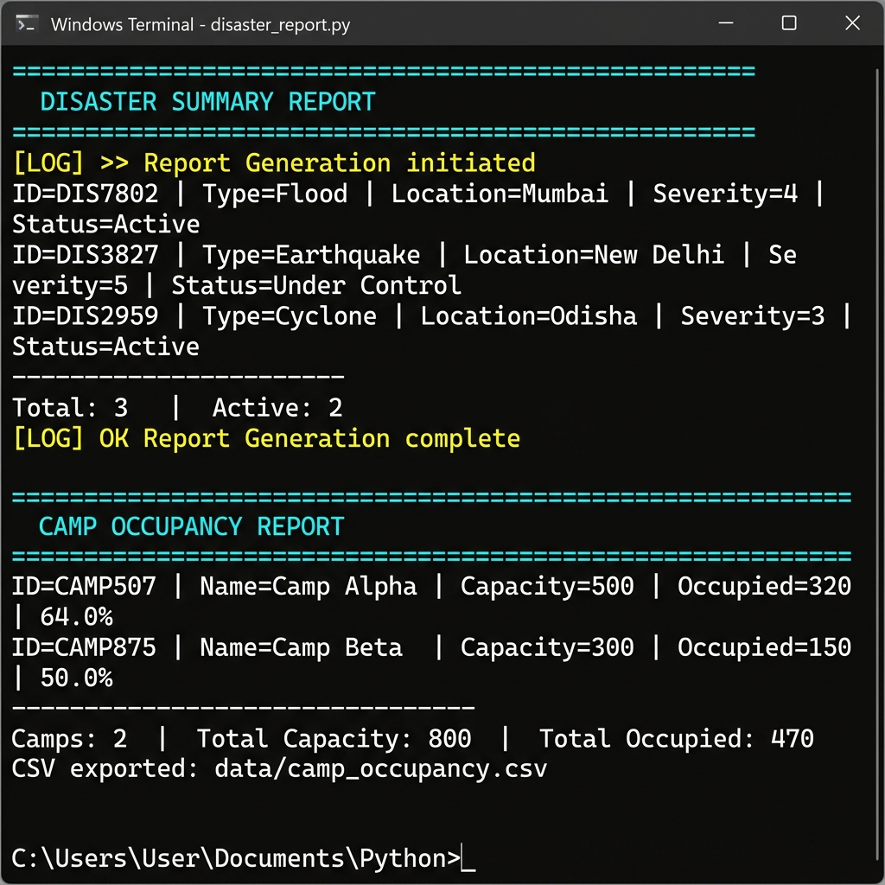
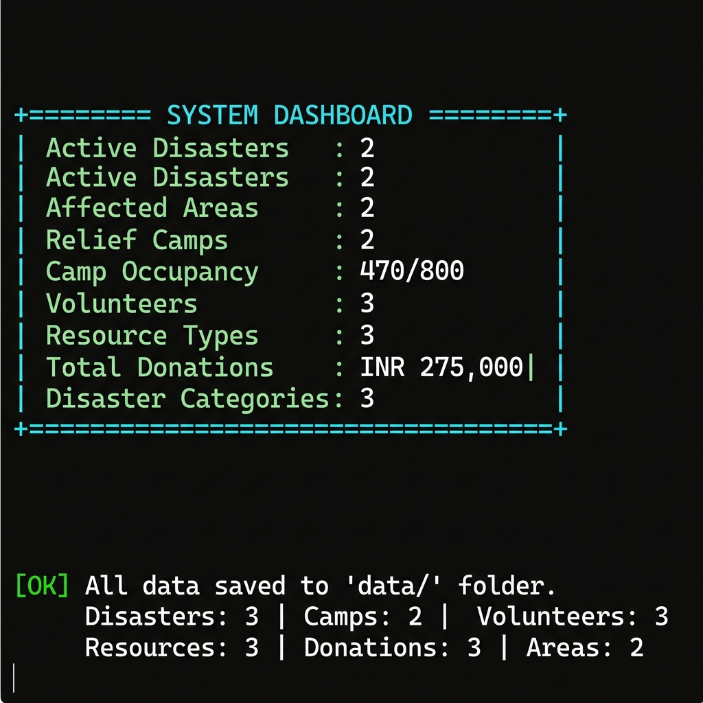

# 🚨 Disaster Relief Resource Management System

> **A comprehensive Python console application for coordinating resources during natural disasters.**
> Built as a B.Tech CSE Semester Project at Noida Institute of Engineering and Technology.

---

## 📋 Table of Contents

- [Project Overview](#-project-overview)
- [Features](#-features)
- [Screenshots](#-screenshots)
- [Project Structure](#-project-structure)
- [Python Concepts Implemented](#-python-concepts-implemented)
- [OOP Concepts Implemented](#-oop-concepts-implemented)
- [Installation & Running](#-installation--running)
- [How to Use](#-how-to-use)
- [Data Storage](#-data-storage)
- [Learning Outcomes](#-learning-outcomes)

---

## 🌍 Project Overview

The **Disaster Relief Resource Management System** is a Python-based console application that helps authorities manage and coordinate resources during natural disasters such as floods, earthquakes, cyclones, pandemics, and other emergencies.

The system enables:
- Tracking affected areas and populations
- Managing relief camps and occupancy
- Allocating resources (food, water, medicine)
- Registering and assigning volunteers
- Recording donations and generating receipts
- Producing disaster reports and CSV exports

---

## ✨ Features

| Module | Capabilities |
|---|---|
| **Disaster Management** | Register disasters, update status, search (recursive), sort by severity |
| **Affected Area Management** | Add areas with geo-coordinates, track population, damage reports |
| **Relief Camp Management** | Create camps, allocate/release people, enforce capacity limits |
| **Resource Management** | Inventory (dict-based), allocate food/water/medicine, restock |
| **Volunteer Management** | Register, assign tasks, track availability, skill grouping |
| **Donation Management** | Record donations, generate receipts, fund summary, donor history |
| **Report Generation** | Generator-based reports, CSV export (3 report types) |
| **Save / Load Data** | Full JSON persistence with round-trip serialization |
| **Dashboard** | Real-time system-wide statistics |
| **Emergency Helplines** | National disaster helpline numbers |

---

## 📸 Screenshots

### 1. Main Menu


---

### 2. Disaster Management — Register & View


---

### 3. Donation Processing — Receipt & Fund Summary


---

### 4. Report Generation — Disaster & Camp Reports


---

### 5. System Dashboard & Data Save


---

## 📁 Project Structure

```
disaster_relief_system/
│
├── main.py                      # Entry point — 11-option menu loop + DMS composition root
│
├── models/                      # All OOP entity classes
│   ├── person.py                # Abstract Base Class (ABC) — Person
│   ├── volunteer.py             # Volunteer(Person) — Inheritance + Polymorphism
│   ├── donor.py                 # Donor(Person) — Encapsulation with name mangling
│   ├── disaster.py              # Disaster — @staticmethod + @classmethod
│   ├── affected_area.py         # AffectedArea — location stored as Tuple
│   ├── relief_camp.py           # ReliefCamp — CampCapacityExceeded handling
│   ├── resource.py              # Resource — inventory item
│   ├── donation.py              # Donation — receipt generation
│   └── report.py                # Report — CSV export
│
├── modules/                     # Business logic managers
│   ├── disaster_manager.py      # Recursive search, status updates
│   ├── area_manager.py          # Area CRUD + resource estimation
│   ├── camp_manager.py          # Camp creation + capacity enforcement
│   ├── resource_manager.py      # @log_allocation + list comprehensions
│   ├── volunteer_manager.py     # Task assignment + availability tracking
│   ├── donation_manager.py      # @log_donation + Donor encapsulation
│   └── report_manager.py        # Generators (yield) + @log_report + CSV
│
├── utils/                       # Shared utilities
│   ├── decorators.py            # log_action() decorator factory
│   ├── validators.py            # 7 custom exception classes + input validators
│   └── helpers.py               # Recursive search, 3 lambda sorts, static utils
│
├── screenshots/                 # Application screenshots
│
└── data/                        # Auto-created JSON + CSV persistence files
    ├── disasters.json
    ├── camps.json
    ├── volunteers.json
    ├── areas.json
    ├── resources.json
    ├── donations.json
    ├── donors.json
    ├── relief_distribution.csv
    ├── donation_report.csv
    └── camp_occupancy.csv
```

---

## 🐍 Python Concepts Implemented

| Concept | Implementation | File |
|---|---|---|
| Variables & Data Types | Throughout all files | All |
| Conditional Statements | Menu routing, validation | `main.py`, all managers |
| Loops | `while True` menu loop | `main.py` |
| User-defined Functions | `allocate_resource()`, `register_disaster()` | `modules/*.py` |
| **Recursive Function** | `search_disaster(records, id, index=0)` | `utils/helpers.py` |
| **Lambda Functions** | 3 sort lambdas (severity, occupancy, amount) | `utils/helpers.py` |
| **List** | `self.disasters`, `self.volunteers`, `self.camps` | `main.py` |
| **Dictionary** | `self.resources = {resource_id: Resource}` | `main.py` |
| **Set** | `self.disaster_categories = set()` | `main.py` |
| **Tuple** | `location_coords = (lat, lng)` — fixed geo-coords | `models/affected_area.py` |
| **List Comprehension** | `[r for r in resources.values() if r.quantity > 0]` | `resource_manager.py` |
| **Decorators** | `@log_action('Resource Allocation')` factory | `utils/decorators.py` |
| **Generators** | `yield` in all report methods | `modules/report_manager.py` |
| JSON File Handling | `save_data()` / `load_data()` | `main.py` |
| CSV File Handling | `export_report()` via `csv.writer` | `report_manager.py` |
| Exception Handling | 7 custom + built-in exceptions | `utils/validators.py` |
| Multiple Modules | `models/`, `modules/`, `utils/` | Project structure |

### Python Modules Used
- `abc` — Abstract base class support
- `datetime` — Timestamps for all records and logs
- `json` — Serialize/deserialize entity records
- `csv` — Export formatted report files
- `os` — File path checks, directory creation (`os.makedirs`)
- `random` — Generate unique IDs for entities
- `sys` / `io` — UTF-8 console output on Windows

---

## 🏗️ OOP Concepts Implemented

### Class Hierarchy

```
Person (Abstract — ABC)
├── Volunteer(Person)     — Inheritance + Polymorphism
└── Donor(Person)         — Inheritance + Encapsulation

DisasterManagementSystem  — Composition Root
├── disasters: list       — Disaster objects
├── camps: list           — ReliefCamp objects
├── volunteers: list      — Volunteer objects
├── areas: list           — AffectedArea objects
├── donations: list       — Donation objects
├── resources: dict       — {id: Resource}
└── disaster_categories: set
```

| OOP Concept | Implementation |
|---|---|
| **Abstraction** | `Person` is an abstract class with `@abstractmethod display_details()` |
| **Inheritance** | `Volunteer(Person)` and `Donor(Person)` inherit from `Person` |
| **Polymorphism** | `display_details()` implemented differently in `Volunteer` vs `Donor` |
| **Encapsulation** | `Donor.__donor_id` and `Donor.__donation_amount` are name-mangled (private) |
| **Composition** | `DisasterManagementSystem` owns all entity lists and manager instances |
| **@staticmethod** | `Disaster.get_emergency_types()`, `ReliefCamp.minimum_camp_size()` |
| **@classmethod** | `Disaster.get_total_count()`, `Disaster.get_active_count()` |
| **Magic Methods** | `__init__`, `__str__`, `__repr__` on all model classes |
| **`__init__()`** | Constructors with full attribute initialization in all 9 classes |

### Custom Exception Classes

```python
InvalidDisasterID        # Bad or missing disaster ID
InvalidResourceQuantity  # Zero / negative / excess quantity
CampCapacityExceeded     # Over-capacity allocation attempt
InvalidDonationEntry     # Invalid donation amount
ResourceNotFound         # Resource ID missing from inventory
InvalidAreaID            # Area ID not found
InvalidVolunteerID       # Volunteer ID not found
```

---

## 🚀 Installation & Running

### Requirements
- Python 3.9 or above
- No external libraries required (uses only standard library)

### Run the Application

```powershell
# Navigate to the project folder
cd "C:\Users\shash\Disaster Resource Management System\disaster_relief_system"

# Run
py -3 main.py
```

> **Note:** Data is automatically saved to the `data/` folder on every exit and can be reloaded on next run.

---

## 📖 How to Use

### Main Menu Options

| Option | Feature |
|---|---|
| `1` | Disaster Management (register, update, search, view) |
| `2` | Affected Area Management (add, update, damage report) |
| `3` | Relief Camp Management (create, allocate people, view occupancy) |
| `4` | Resource Management (add, allocate, restock, view inventory) |
| `5` | Volunteer Management (register, assign tasks, view availability) |
| `6` | Donation Management (record donation, receipt, fund summary) |
| `7` | Report Generation (summary reports + CSV export) |
| `8` | Save all data to JSON files |
| `9` | Load data from JSON files |
| `10` | System Dashboard |
| `11` | Emergency Helpline Numbers |
| `0` | Exit (auto-saves before closing) |

### Example Workflow

```
1. Register a disaster (e.g., Flood in Mumbai, Severity 4)
2. Add affected areas (e.g., Dharavi — 150,000 people, High damage)
3. Create relief camps and allocate displaced persons
4. Add resources to inventory (rice, water, medicine kits)
5. Register volunteers and assign rescue tasks
6. Record donations and generate receipts
7. Generate disaster summary report and export CSV files
8. Save data → loads automatically on next run
```

---

## 💾 Data Storage

### JSON Files (Persistence)
All records are saved as JSON using `to_dict()` / `from_dict()` on each model class:

```json
// disasters.json (sample)
[
  {
    "disaster_id": "DIS7802",
    "disaster_type": "Flood",
    "location": "Mumbai, Maharashtra",
    "severity_level": 4,
    "status": "Active",
    "registered_on": "2026-06-10 15:43:57"
  }
]
```

### CSV Reports (Exports)

| File | Columns |
|---|---|
| `relief_distribution.csv` | Resource ID, Name, Category, Quantity, Unit |
| `donation_report.csv` | Donation ID, Donor Name, Amount, Type, Date, Note |
| `camp_occupancy.csv` | Camp ID, Name, Location, Capacity, Occupied, % |

---

## 🎓 Learning Outcomes

This project demonstrates all **24 Python learning outcomes** from the course specification:

- [x] Core Python — variables, loops, conditions
- [x] User-defined functions
- [x] Recursive function (`search_disaster`)
- [x] Lambda functions (3 sort lambdas)
- [x] List, Dictionary, Set, Tuple — all four used
- [x] List comprehensions
- [x] Decorators (`@log_action` factory)
- [x] Generators (`yield` in report engine)
- [x] Multiple modules and files
- [x] Classes and objects (10 entity classes)
- [x] Inheritance (`Volunteer`, `Donor` from `Person`)
- [x] Encapsulation (name mangling in `Donor`)
- [x] Polymorphism (`display_details()` overridden differently)
- [x] Abstraction (`Person` abstract class with `@abstractmethod`)
- [x] Composition (`DisasterManagementSystem` owns all entities)
- [x] Static methods (`@staticmethod`)
- [x] Class methods (`@classmethod`)
- [x] Magic methods (`__init__`, `__str__`, `__repr__`)
- [x] JSON file handling (save/load all records)
- [x] CSV file handling (3 report exports)
- [x] Exception handling (7 custom exceptions + built-in)
- [x] Menu-driven programming (11-option interactive CLI)

---

## 👨‍💻 Author

**B.Tech CSE**
Noida Institute of Engineering and Technology (NIET)
Semester Python Project — 2026

---

> *"Every resource saved is a life saved."*
